# 服薬リマインダーシステム - 機能フロー設計

## 📋 システム概要

**個人の服薬時間管理を補助する**LINE Bot連携システムの機能フローです。ユーザーが自分で薬剤情報を登録し、設定したスケジュールに従って服薬リマインダーを受け取り、服薬記録を管理できるシンプルで実用的なツールを目指します。

---

## 🎯 1. ユーザー登録・初期設定フロー

### 1.1 アカウント作成
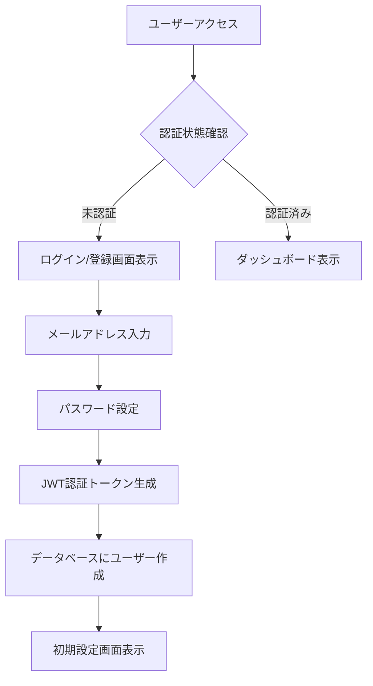

**実装箇所:**
- Backend: `src/controllers/auth.rs` - 認証API
- Frontend: `src/components/Auth/` - 認証画面
- Database: `users` テーブル

### 1.2 LINE Bot連携設定
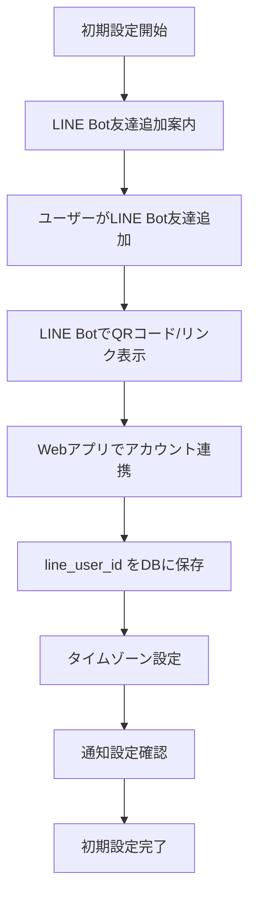

**技術仕様:**
- LINE Messaging API使用
- 環境変数: `LINE_CHANNEL_SECRET`, `LINE_CHANNEL_ACCESS_TOKEN`

---

## 💊 2. 個人薬剤管理フロー

### 2.1 手動薬剤登録
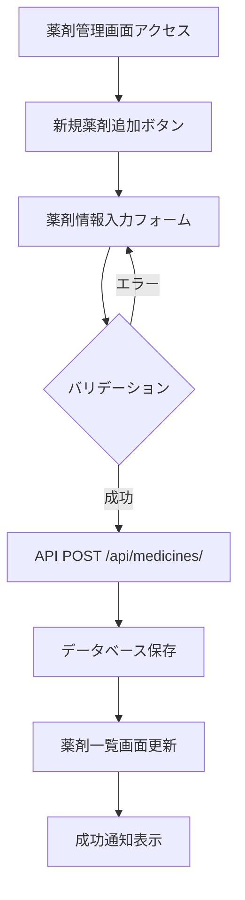

**ユーザー入力項目（すべて手動）:**
- **薬剤名** (必須) - 例: "ロキソニン", "アスピリン"
- **説明** (任意) - 例: "頭痛薬", "血圧の薬"
- **用量** (任意) - 例: "1", "0.5"
- **単位** (任意) - 例: "錠", "ml", "包"
- **メモ** (任意) - 例: "食後に服用", "朝食と一緒に"

### 2.2 薬剤編集・無効化
```mermaid
graph TD
    A[薬剤一覧表示] --> B[編集/無効化アクション選択]
    B -->|編集| C[編集フォーム表示]
    B -->|無効化| D[無効化確認ダイアログ]
    C --> E[API PUT /api/medicines/{id}]
    D --> F[API PATCH /api/medicines/{id} active=false]
    E --> G[データベース更新]
    F --> H[薬剤を非表示に]
    G --> I[一覧画面更新]
    H --> I
```

**注意**: 削除ではなく無効化で履歴を保持

---

## ⏰ 3. 個人服薬スケジュール管理フロー

### 3.1 スケジュール作成
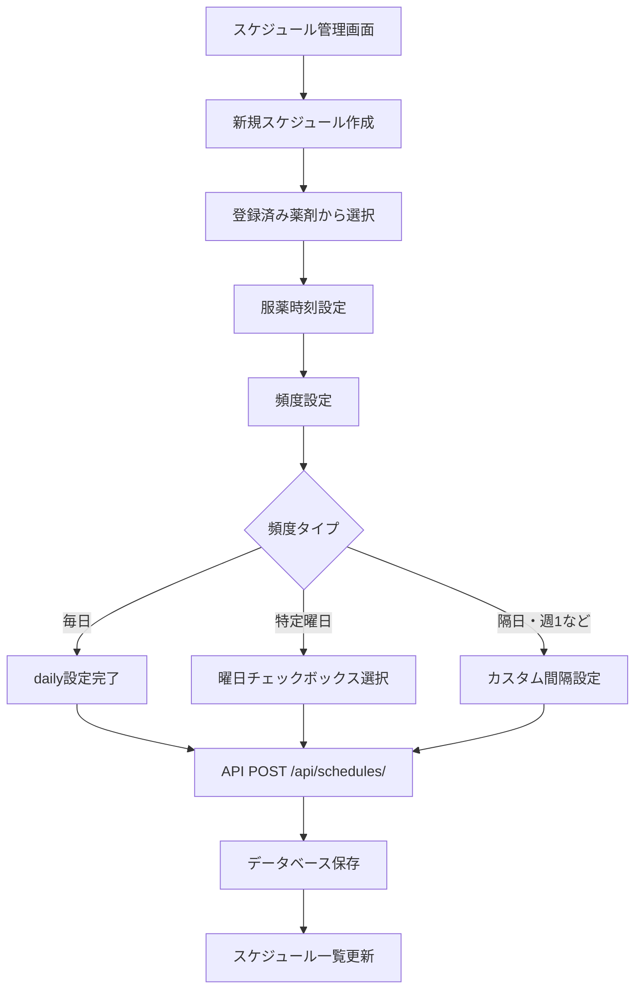

**スケジュール設定例:**
- **毎朝8時**: `time: 08:00, frequency: daily`
- **月水金の夜**: `time: 21:00, frequency: weekly, days: [1,3,5]`
- **隔日**: `time: 12:00, frequency: custom, interval: 2日`

### 3.2 スケジュール調整
```mermaid
graph TD
    A[スケジュール一覧] --> B{操作選択}
    B -->|時刻変更| C[時刻調整フォーム]
    B -->|一時停止| D[active=false設定]
    B -->|再開| E[active=true設定]
    B -->|削除| F[削除確認]
    C --> G[API PUT /api/schedules/{id}]
    D --> H[API PATCH /api/schedules/{id}]
    E --> H
    F --> I[API DELETE /api/schedules/{id}]
    G --> J[スケジュール更新]
    H --> J
    I --> J
```

---

## 🔔 4. 自動リマインダー・通知フロー

### 4.1 定期スケジュールチェック
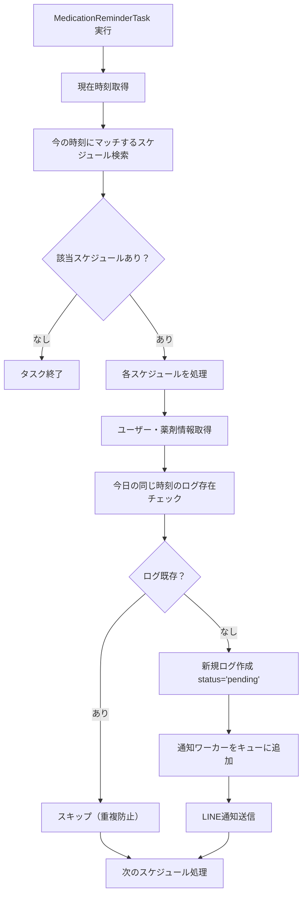

**実行タイミング**: 毎時間 (例: 8:00, 9:00, 10:00...)

### 4.2 LINE通知送信
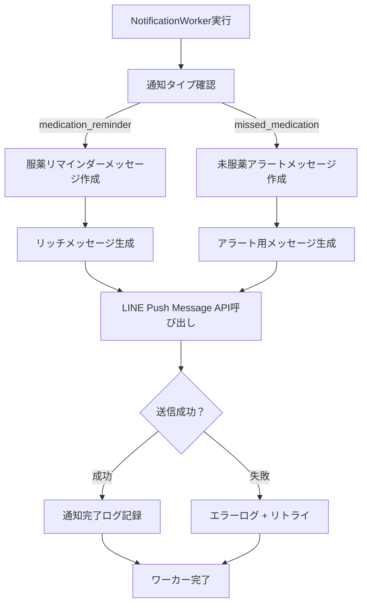

**通知メッセージ例:**
```
💊 服薬時間のお知らせ

お薬: ロキソニン 1錠
予定時刻: 8:00
メモ: 朝食後に服用

服薬が完了したら「完了」と
返信してください ✨
```

---

## 📝 5. 個人服薬記録管理フロー

### 5.1 自動ログ生成
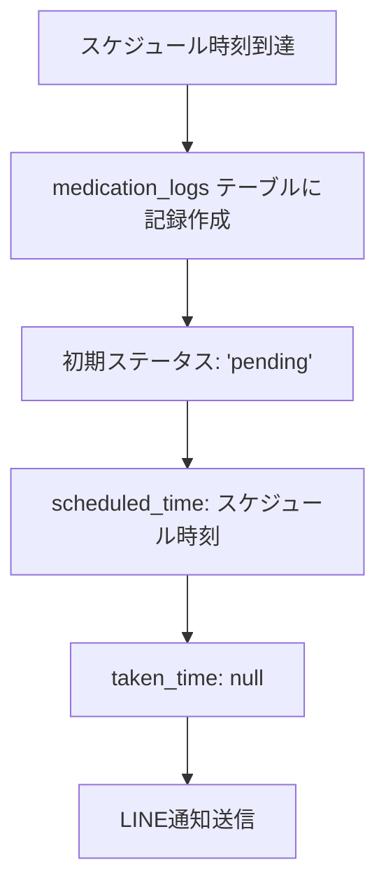

### 5.2 ユーザーからの服薬報告
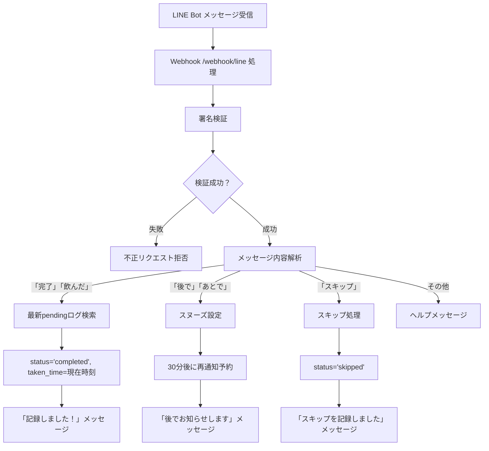

### 5.3 未服薬アラート
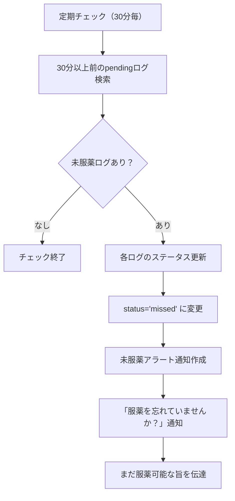

---

## 📊 6. 個人統計・ダッシュボードフロー

### 6.1 日次統計表示
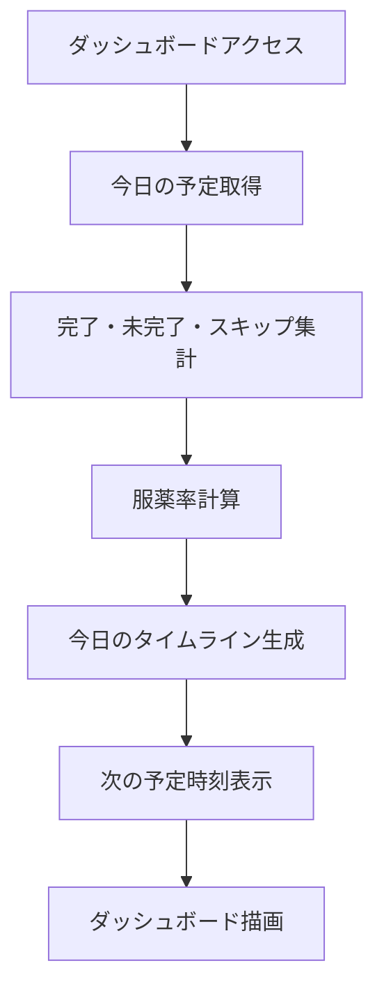

**表示項目:**
- **今日の服薬率**: 完了数 / 予定数 × 100%
- **今日の予定リスト**: 時刻順、ステータス付き
- **次の服薬予定**: 残り時間表示
- **最近の服薬活動**: 直近5件のログ

### 6.2 週間・月間統計
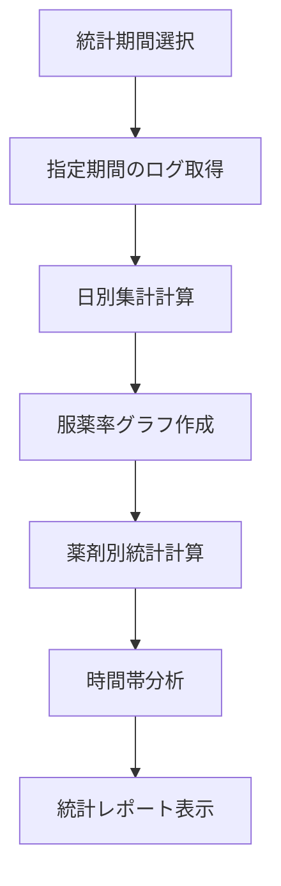

**分析項目:**
- **週間服薬率推移**: 7日間のグラフ
- **薬剤別遵守率**: 薬ごとの完了率
- **時間帯別傾向**: 朝・昼・夜の遵守パターン
- **スキップ理由分析**: よく忘れる時間帯など

---

## ⚙️ 7. 個人設定・カスタマイズフロー

### 7.1 通知設定調整
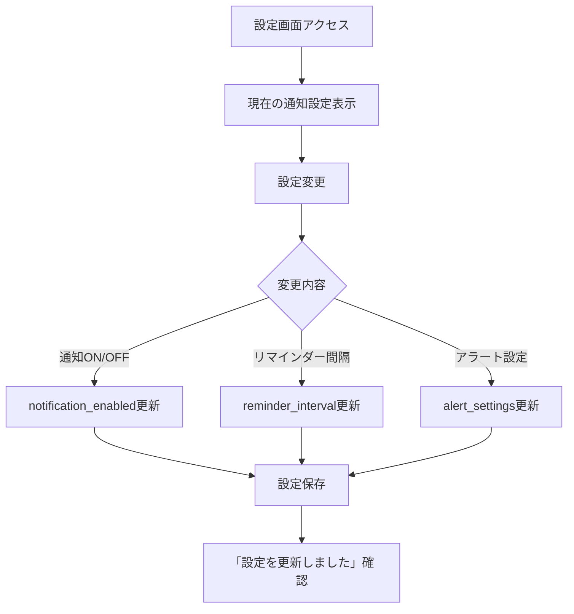

**カスタマイズ可能項目:**
- **通知の有効/無効**: 全体的なON/OFF
- **リマインダー頻度**: 1回のみ / 5分後にもう一度 / 10分間隔で3回
- **未服薬アラート**: 30分後 / 1時間後 / OFF
- **通知時間帯制限**: 朝7時〜夜10時のみなど

### 7.2 表示設定
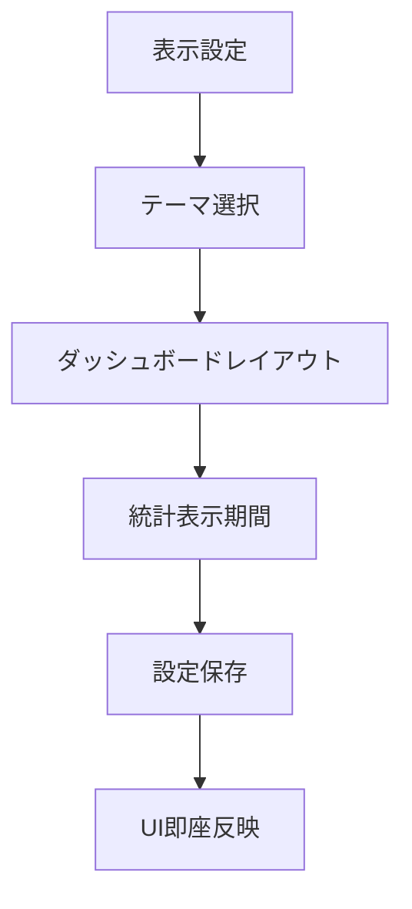

---

## 🔄 8. データ管理・メンテナンスフロー

### 8.1 個人データエクスポート
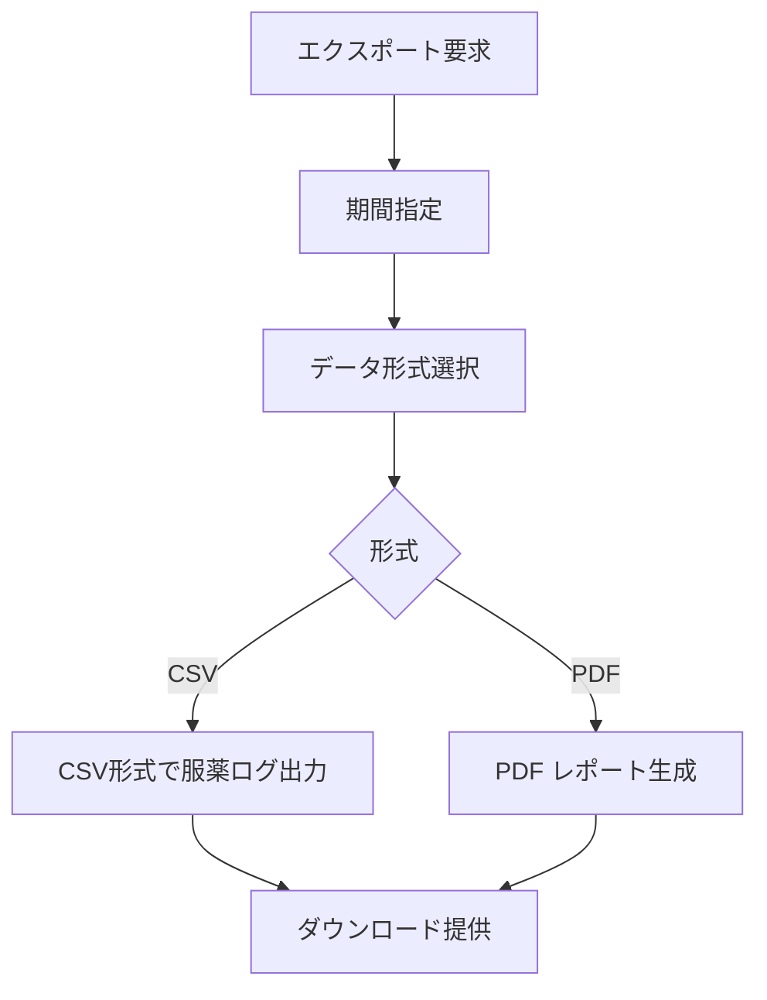

### 8.2 自動データ整理
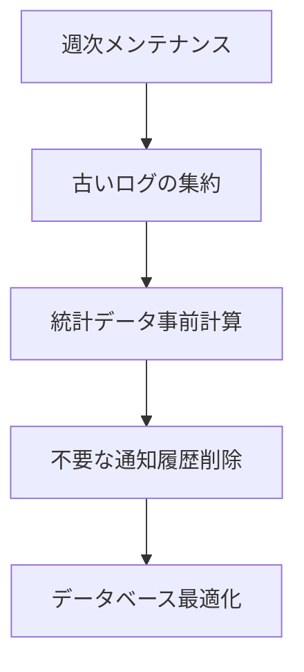

---

## 🔒 9. プライバシー・セキュリティフロー

### 9.1 個人データ保護
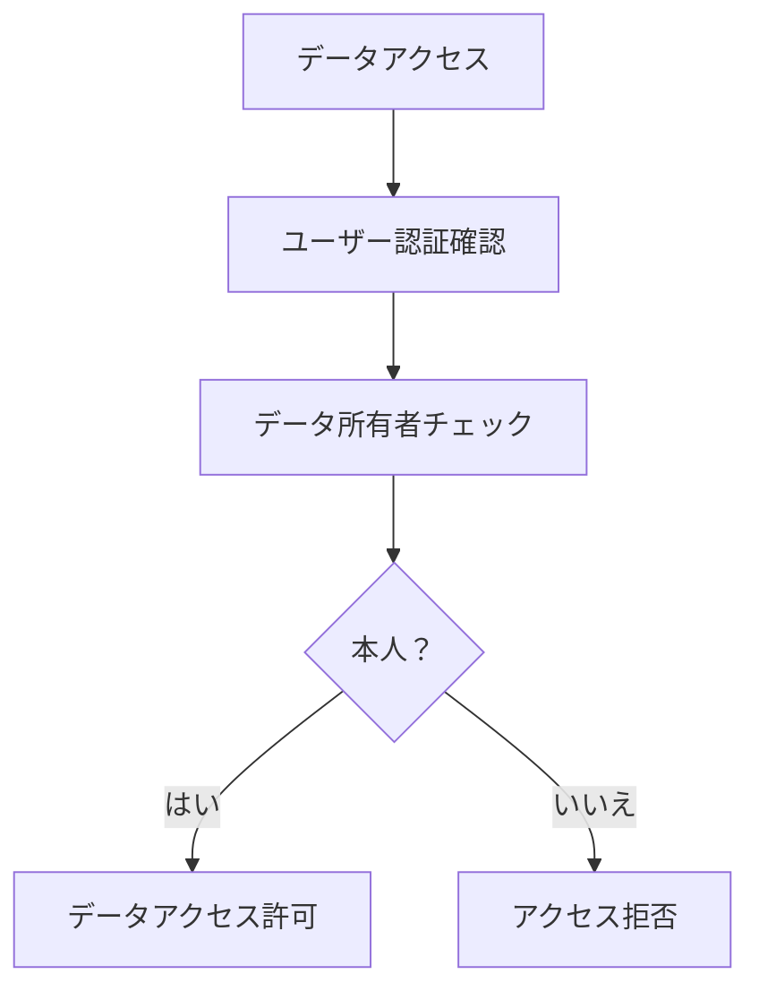

### 9.2 データ削除・退会
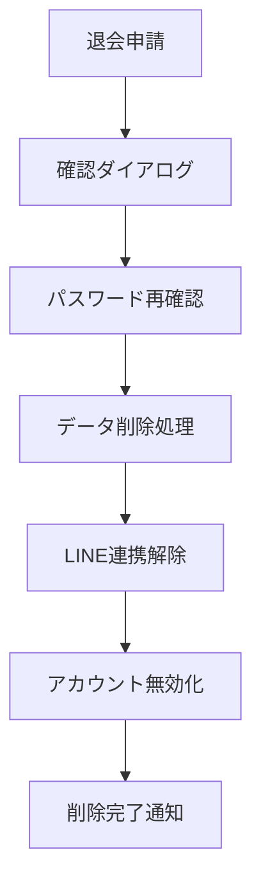

---

## 📱 10. ユーザビリティ・アクセシビリティフロー

### 10.1 シンプルな操作フロー
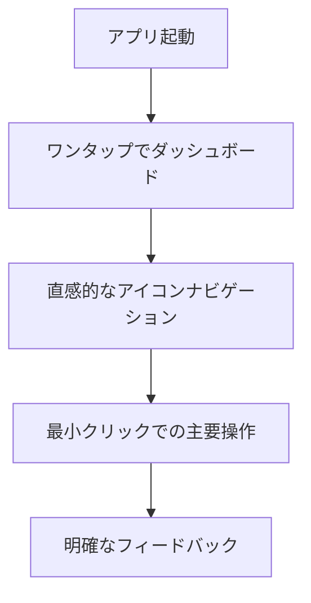

### 10.2 多様なデバイス対応
```mermaid
graph TD
    A[アクセス] --> B[デバイス検出]
    B --> C{デバイス}
    C -->|スマートフォン| D[タッチ操作最適化]
    C -->|タブレット| E[中間サイズ対応]
    C -->|PC| F[キーボード操作対応]
```

---

## 🎯 11. 実装優先順位（修正版）

### Phase 1: 基本機能 (v1.0) - 個人管理の核心
1. ✅ ユーザー認証システム
2. 🚧 個人薬剤管理 (手動登録のみ)
3. 🚧 シンプルなスケジュール設定
4. 🚧 LINE Bot基本通知
5. 🚧 服薬記録・完了報告

### Phase 2: 利便性向上 (v1.1) - 使いやすさ重視
1. ❌ 詳細統計・個人レポート
2. ❌ 柔軟な通知カスタマイズ
3. ❌ データエクスポート
4. ❌ モバイル操作性向上

### Phase 3: 高度な個人管理 (v2.0) - パーソナライゼーション
1. ❌ 個人パターン学習（服薬傾向分析）
2. ❌ カスタム通知タイミング
3. ❌ 多言語対応
4. ❌ 音声入力対応

---

## 🔧 技術実装の焦点

### シンプルさを重視した設計
- **最小限の入力**: 薬剤名と時刻だけで開始可能
- **直感的UI**: 専門知識不要の操作
- **信頼性**: 通知の確実な配信

### 個人データの完全管理
- **ユーザー主導**: すべての情報をユーザーが入力・管理
- **プライバシー重視**: 医療データの外部送信なし
- **データポータビリティ**: いつでもエクスポート可能

### 実用性重視の機能
```bash
# 核心機能に集中
- 薬剤の手動登録・管理
- シンプルなスケジュール設定
- 確実なLINE通知
- 簡単な服薬記録
- 基本的な統計表示
```

---

この修正版フローは**個人の服薬時間管理補助**に特化し、シンプルで実用的なツールとして設計されています。医療機関連携や複雑な機能は排除し、ユーザーが自分で管理できる範囲の機能に集中しています。

---

## 🎯 1. ユーザー登録・初期設定フロー

### 1.1 アカウント作成
```mermaid
graph TD
    A[ユーザーアクセス] --> B{認証状態確認}
    B -->|未認証| C[ログイン/登録画面表示]
    B -->|認証済み| D[ダッシュボード表示]
    C --> E[メールアドレス入力]
    E --> F[パスワード設定]
    F --> G[JWT認証トークン生成]
    G --> H[データベースにユーザー作成]
    H --> I[初期設定画面表示]
```

**実装箇所:**
- Backend: `src/controllers/auth.rs` - 認証API
- Frontend: `src/components/Auth/` - 認証画面
- Database: `users` テーブル

### 1.2 LINE Bot連携設定
```mermaid
graph TD
    A[初期設定開始] --> B[LINE Bot友達追加案内]
    B --> C[ユーザーがLINE Bot友達追加]
    C --> D[LINE BotでQRコード/リンク表示]
    D --> E[Webアプリでアカウント連携]
    E --> F[line_user_id をDBに保存]
    F --> G[タイムゾーン設定]
    G --> H[通知設定]
    H --> I[初期設定完了]
```

**技術仕様:**
- LINE Messaging API使用
- LIFF (LINE Front-end Framework) でWebビュー連携
- 環境変数: `LINE_CHANNEL_SECRET`, `LINE_CHANNEL_ACCESS_TOKEN`

---

## 💊 2. 薬剤管理フロー

### 2.1 薬剤登録
```mermaid
graph TD
    A[薬剤管理画面アクセス] --> B[新規薬剤追加ボタン]
    B --> C[薬剤情報入力フォーム]
    C --> D{バリデーション}
    D -->|エラー| C
    D -->|成功| E[API POST /api/medicines/]
    E --> F[データベース保存]
    F --> G[薬剤一覧画面更新]
    G --> H[成功通知表示]
```

**入力項目:**
- 薬剤名 (必須)
- 説明 (任意)
- 用量 (例: "1")
- 単位 (例: "錠", "ml")
- 有効/無効フラグ

**実装箇所:**
- Backend: `src/controllers/medicine.rs` - CRUD API
- Frontend: `src/components/medicine/` - 薬剤管理UI
- Database: `medicines` テーブル

### 2.2 薬剤編集・削除
```mermaid
graph TD
    A[薬剤一覧表示] --> B[編集/削除アクション選択]
    B -->|編集| C[編集フォーム表示]
    B -->|削除| D[削除確認ダイアログ]
    C --> E[API PUT /api/medicines/{id}]
    D --> F[API DELETE /api/medicines/{id}]
    E --> G[データベース更新]
    F --> H[データベースから削除]
    G --> I[一覧画面更新]
    H --> I
```

---

## ⏰ 3. 服薬スケジュール管理フロー

### 3.1 スケジュール作成
```mermaid
graph TD
    A[スケジュール管理画面] --> B[新規スケジュール作成]
    B --> C[薬剤選択]
    C --> D[服薬時刻設定]
    D --> E[頻度設定]
    E --> F{頻度タイプ}
    F -->|毎日| G[daily設定]
    F -->|週間| H[曜日選択]
    F -->|カスタム| I[カスタム間隔設定]
    G --> J[API POST /api/schedules/]
    H --> J
    I --> J
    J --> K[データベース保存]
    K --> L[スケジュール一覧更新]
```

**スケジュール設定項目:**
- 対象薬剤 (medicine_id)
- 服薬時刻 (time: HH:MM:SS)
- 頻度 ("daily", "weekly", "custom")
- 曜日指定 (days_of_week: JSON配列)
- 有効/無効フラグ

**実装箇所:**
- Backend: `src/controllers/medication_schedules.rs`
- Frontend: `src/components/ScheduleManagement.tsx`
- Database: `medication_schedules` テーブル

### 3.2 スケジュール更新・削除
```mermaid
graph TD
    A[スケジュール一覧] --> B{操作選択}
    B -->|編集| C[編集フォーム]
    B -->|一時停止| D[active=false設定]
    B -->|削除| E[削除確認]
    C --> F[API PUT /api/schedules/{id}]
    D --> G[API PATCH /api/schedules/{id}]
    E --> H[API DELETE /api/schedules/{id}]
    F --> I[データベース更新]
    G --> I
    H --> I
    I --> J[UI更新]
```

---

## 🔔 4. 自動通知・リマインダーフロー

### 4.1 スケジュールタスク実行
```mermaid
graph TD
    A[MedicationReminderTask 実行] --> B[現在時刻取得]
    B --> C[アクティブスケジュール検索]
    C --> D{該当スケジュールあり？}
    D -->|なし| E[タスク終了]
    D -->|あり| F[各スケジュールを処理]
    F --> G[ユーザー・薬剤情報取得]
    G --> H[服薬ログ存在チェック]
    H --> I{ログ既存？}
    I -->|あり| J[スキップ]
    I -->|なし| K[新規ログ作成]
    K --> L[通知ワーカーエンキュー]
    L --> M[LINE通知送信]
    J --> N[次のスケジュール処理]
    M --> N
    N --> O{全スケジュール完了？}
    O -->|いいえ| F
    O -->|はい| E
```

**技術仕様:**
- 実行間隔: 毎時間 (cron: 0 * * * *)
- 実装箇所: `src/tasks/medication_reminder.rs`
- 背景ジョブ: Redis キューシステム

### 4.2 LINE Bot通知送信
```mermaid
graph TD
    A[NotificationWorker実行] --> B[通知タイプ確認]
    B -->|medication_reminder| C[服薬リマインダーメッセージ作成]
    B -->|missed_medication| D[未服薬アラートメッセージ作成]
    B -->|general| E[一般メッセージ]
    C --> F[LINE Flex Message生成]
    D --> G[アラート用Flex Message生成]
    E --> H[テキストメッセージ]
    F --> I[LINE Push Message API呼び出し]
    G --> I
    H --> I
    I --> J{送信成功？}
    J -->|成功| K[通知履歴記録]
    J -->|失敗| L[エラーログ記録]
    K --> M[ワーカー完了]
    L --> N[リトライ処理]
    N --> M
```

**LINE通知内容例:**
```
💊 服薬時間です

お薬: アスピリン 100mg
時刻: 08:00
用量: 1錠

[服薬完了] [後で] [スキップ]
```

---

## 📝 5. 服薬記録・ログ管理フロー

### 5.1 服薬記録の自動生成
```mermaid
graph TD
    A[スケジュール時刻到達] --> B[medication_logs テーブルに記録作成]
    B --> C[ステータス: 'pending' 設定]
    C --> D[scheduled_time 設定]
    D --> E[LINE通知送信]
    E --> F[ユーザー応答待機]
```

### 5.2 ユーザーからの応答処理
```mermaid
graph TD
    A[LINE Bot メッセージ受信] --> B[Webhook /webhook/line]
    B --> C[署名検証]
    C --> D{検証成功？}
    D -->|失敗| E[リクエスト拒否]
    D -->|成功| F[メッセージタイプ判定]
    F -->|服薬完了| G[ログステータス更新: 'completed']
    F -->|後で| H[スヌーズ設定]
    F -->|スキップ| I[ログステータス更新: 'skipped']
    F -->|その他| J[一般応答]
    G --> K[taken_time 現在時刻設定]
    H --> L[30分後再通知設定]
    I --> M[notes フィールド更新]
    K --> N[確認メッセージ送信]
    L --> N
    M --> N
    J --> N
```

### 5.3 未服薬検知・アラート
```mermaid
graph TD
    A[定期チェック実行] --> B[30分前のpendingログ検索]
    B --> C{未服薬ログあり？}
    C -->|なし| D[チェック終了]
    C -->|あり| E[ステータス: 'missed' 更新]
    E --> F[アラート通知作成]
    F --> G[LINE未服薬通知送信]
    G --> H[次のログ処理]
    H --> I{全ログ処理完了？}
    I -->|いいえ| E
    I -->|はい| D
```

---

## 📊 6. ダッシュボード・統計表示フロー

### 6.1 ダッシュボードデータ集計
```mermaid
graph TD
    A[ダッシュボードアクセス] --> B[API GET /api/dashboard]
    B --> C[今日の統計計算]
    C --> D[今日のスケジュール取得]
    D --> E[完了率計算]
    E --> F[週間統計計算]
    F --> G[最近のログ取得]
    G --> H[統合データ返却]
    H --> I[フロントエンド描画]
```

**表示項目:**
- **今日の服薬率**: 完了数 / 予定数 × 100%
- **今日の予定**: 時刻順リスト
- **最近の活動**: 直近の服薬ログ
- **週間グラフ**: 7日間の遵守率推移
- **統計カード**: 総薬剤数、アクティブスケジュール数等

### 6.2 レポート生成
```mermaid
graph TD
    A[レポート画面アクセス] --> B[期間・タイプ選択]
    B --> C[API GET /api/reports]
    C --> D[データベースクエリ実行]
    D --> E[統計計算]
    E --> F{レポートタイプ}
    F -->|遵守率| G[adherence_rate 計算]
    F -->|薬剤別| H[medicine_analysis 生成]
    F -->|時系列| I[time_series_data 作成]
    G --> J[グラフデータ生成]
    H --> J
    I --> J
    J --> K[フロントエンド表示]
```

---

## ⚙️ 7. 設定・プロファイル管理フロー

### 7.1 ユーザー設定更新
```mermaid
graph TD
    A[設定画面アクセス] --> B[現在設定表示]
    B --> C[設定項目変更]
    C --> D{変更タイプ}
    D -->|通知設定| E[notification_enabled 更新]
    D -->|タイムゾーン| F[timezone 更新]
    D -->|表示名| G[display_name 更新]
    D -->|パスワード| H[password_hash 更新]
    E --> I[API PUT /api/user/settings]
    F --> I
    G --> I
    H --> I
    I --> J[データベース更新]
    J --> K[設定画面更新]
```

### 7.2 LINE Bot連携管理
```mermaid
graph TD
    A[連携設定] --> B{現在の状態}
    B -->|未連携| C[QRコード表示]
    B -->|連携済み| D[連携解除オプション]
    C --> E[ユーザーがQRスキャン]
    E --> F[LIFF アプリ起動]
    F --> G[アカウント連携確認]
    G --> H[line_user_id 更新]
    D --> I[連携解除確認]
    I --> J[line_user_id NULL設定]
    H --> K[連携完了通知]
    J --> L[連携解除完了]
```

---

## 🔄 8. バックグラウンド処理・メンテナンスフロー

### 8.1 定期メンテナンスタスク
```mermaid
graph TD
    A[日次メンテナンス実行] --> B[古いログ削除]
    B --> C[通知履歴整理]
    C --> D[統計データ事前計算]
    D --> E[データベース最適化]
    E --> F[エラーログ分析]
    F --> G[アラート送信判定]
    G --> H[メンテナンス完了]
```

### 8.2 レポート生成ワーカー
```mermaid
graph TD
    A[週次レポート生成] --> B[全ユーザーデータ取得]
    B --> C[個別レポート作成]
    C --> D[PDF/CSV生成]
    D --> E[メール送信 (将来)]
    E --> F[生成完了ログ記録]
```

---

## 🔒 9. セキュリティ・認証フロー

### 9.1 JWT認証
```mermaid
graph TD
    A[API リクエスト] --> B[Authorization ヘッダー確認]
    B --> C{JWT トークン存在？}
    C -->|なし| D[401 Unauthorized]
    C -->|あり| E[JWT署名検証]
    E --> F{検証成功？}
    F -->|失敗| D
    F -->|成功| G[ペイロード展開]
    G --> H[ユーザーID取得]
    H --> I[リクエスト処理続行]
```

### 9.2 LINE Webhook署名検証
```mermaid
graph TD
    A[LINE Webhook受信] --> B[X-Line-Signature ヘッダー取得]
    B --> C[リクエストボディ + チャンネルシークレット]
    C --> D[HMAC-SHA256 計算]
    D --> E[署名比較]
    E --> F{一致？}
    F -->|不一致| G[403 Forbidden]
    F -->|一致| H[メッセージ処理続行]
```

---

## 📱 10. モバイル・レスポンシブ対応フロー

### 10.1 デバイス適応
```mermaid
graph TD
    A[アプリアクセス] --> B[デバイス検出]
    B --> C{デバイスタイプ}
    C -->|Desktop| D[フルレイアウト表示]
    C -->|Tablet| E[中間レイアウト適用]
    C -->|Mobile| F[モバイル最適化レイアウト]
    D --> G[全機能利用可能]
    E --> H[主要機能利用可能]
    F --> I[簡略化UI表示]
```

### 10.2 オフライン対応
```mermaid
graph TD
    A[ネットワーク状態監視] --> B{接続状態}
    B -->|オンライン| C[通常動作]
    B -->|オフライン| D[オフラインモード]
    D --> E[ローカルストレージ使用]
    E --> F[操作キューイング]
    F --> G[再接続時同期]
    G --> C
```

---

## 🎯 11. 実装優先順位（個人管理特化版）

### Phase 1: 基本機能 (v1.0) - 個人管理の核心
1. ✅ ユーザー認証システム
2. 🚧 個人薬剤管理 (手動登録・編集・無効化)
3. 🚧 シンプルなスケジュール設定 (時刻・頻度のみ)
4. 🚧 LINE Bot基本通知 (時刻通知)
5. 🚧 服薬記録・完了報告 (LINEメッセージ応答)

### Phase 2: 利便性向上 (v1.1) - 使いやすさ重視
1. ❌ 個人統計・レポート (週間・月間の服薬率)
2. ❌ 通知カスタマイズ (頻度・時間帯制限)
3. ❌ 未服薬アラート (30分後の再通知)
4. ❌ データエクスポート (CSV・PDF)

### Phase 3: 個人最適化 (v2.0) - パーソナライゼーション
1. ❌ 服薬パターン分析 (よく忘れる時間帯など)
2. ❌ カスタム通知タイミング (個人の生活リズムに合わせて)
3. ❌ 直感的UI改善 (ワンタップ操作など)
4. ❌ 音声入力対応 (「薬を飲みました」音声認識)

---

## 🔧 技術実装の焦点（個人管理特化）

### シンプルさを最優先
```typescript
// 薬剤登録: 最小限の情報
interface Medicine {
  name: string;        // 「ロキソニン」
  dosage?: string;     // 「1錠」(任意)
  notes?: string;      // 「頭痛の時に」(任意)
}

// スケジュール: 直感的設定
interface Schedule {
  time: string;        // "08:00"
  frequency: "daily" | "weekly" | "custom";
  days?: number[];     // [1,3,5] (月水金)
}
```

### 個人データの完全自己管理
- **入力**: ユーザーが手動で薬剤名・時刻を入力
- **管理**: Web UI で薬剤・スケジュールを自由に編集
- **記録**: LINE Bot で簡単に「飲んだ」「後で」「スキップ」
- **分析**: 個人の服薬パターンのみを表示

### 実用性重視の機能範囲
```bash
# 必須機能 (Phase 1)
✅ 薬剤の手動登録・管理
🚧 時刻ベースのスケジュール設定
🚧 LINE通知 (時刻になったらお知らせ)
🚧 服薬記録 (LINEで「完了」と返信)
🚧 基本ダッシュボード (今日の予定・完了状況)

# 便利機能 (Phase 2)
❌ 統計グラフ (週間・月間の遵守率)
❌ 未服薬アラート (30分後の再通知)
❌ 通知設定 (時間帯制限・頻度調整)

# 高度機能 (Phase 3)
❌ パターン学習 (よく忘れる時間を分析)
❌ 個人最適化 (生活リズムに合わせた通知)
```

### 削除された機能（範囲外）
- ❌ 薬局・医療機関連携
- ❌ 処方箋データ自動取込
- ❌ 医師とのデータ共有
- ❌ 副作用モニタリング
- ❌ 在庫管理・薬局通知
- ❌ 家族・介護者への通知

---

## 📝 開発チェックリスト (個人管理特化)

### 🎯 Core Features (必須)
- [ ] 薬剤CRUD API (`/api/medicines`)
- [ ] スケジュール管理API (`/api/schedules`)
- [ ] 服薬ログAPI (`/api/logs`)
- [ ] LINE Bot Webhook (`/webhook/line`)
- [ ] 基本認証・セキュリティ

### 📱 User Experience (重要)
- [ ] 直感的な薬剤登録フォーム
- [ ] シンプルなスケジュール設定UI
- [ ] 分かりやすいダッシュボード
- [ ] モバイルフレンドリーなレスポンス

### 🔔 Notification System (核心)
- [ ] 時刻ベースの自動通知
- [ ] LINE Bot メッセージ応答処理
- [ ] 未服薬アラート (30分後)
- [ ] 通知設定のカスタマイズ

### 📊 Personal Analytics (価値)
- [ ] 個人の服薬率統計
- [ ] 週間・月間レポート
- [ ] よく忘れる時間帯の分析
- [ ] データエクスポート機能

---

この修正版は**個人の服薬時間管理補助**に完全特化し、シンプルで実用的なツールとして再設計されています。医療連携の複雑さを排除し、ユーザーが自分のペースで管理できる親しみやすいシステムを目指します。

---

## 🔧 技術実装メモ

### 主要コンポーネント
- **Backend**: Loco.rs (Rust) + Sea-ORM + Redis
- **Frontend**: React 19 + TypeScript + TanStack Query
- **Database**: PostgreSQL (本番) / SQLite (開発)
- **Queue**: Redis + Loco Background Workers
- **External**: LINE Messaging API

### 重要な設定項目
```bash
# 必須環境変数
LINE_CHANNEL_SECRET=your_secret
LINE_CHANNEL_ACCESS_TOKEN=your_token
JWT_SECRET=your_jwt_secret
DATABASE_URL=postgresql://...
REDIS_URL=redis://...
```

### 開発チェックリスト
- [ ] 全APIエンドポイントの実装
- [ ] LINE Bot Webhook署名検証
- [ ] バックグラウンドワーカー修正
- [ ] フロントエンド状態管理
- [ ] レスポンシブデザイン
- [ ] エラーハンドリング強化
- [ ] テストカバレッジ向上

---

この機能フローに従って実装を進めることで、包括的で使いやすい服薬リマインダーシステムが完成します。各フローは独立性を保ちながら相互に連携し、ユーザーの服薬遵守率向上に寄与します。
